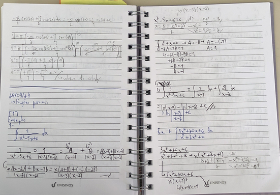
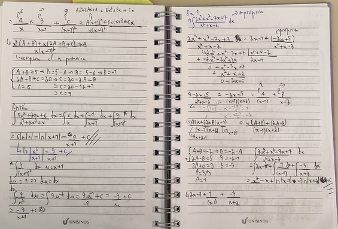
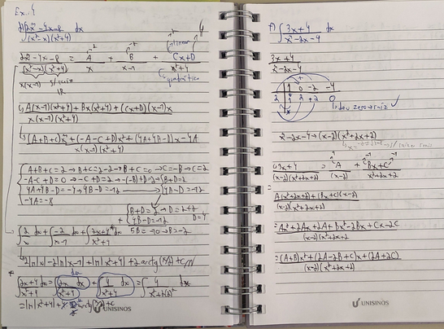
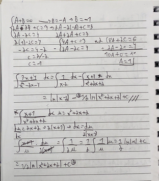

# Integração com frações parciais
Nesse tipo de integração, utilizamos algumas técnicas para resolver integrações de funções polinomiais.
Ela consiste de alguns passos importantes, conforme vou descrever aqui

**Passo 1: Identifique se a fração N(x)/D(x) (onde N(x) é numerador e D(x) é denominador) é imprópria**
Uma fração será imprópria se o grau do numerador for maior que o do denominador. Como em (x³+3)/x².
Divida o numerador pelo denominador. O resultado da divisão fica de fora e será somado ao resultado no final de todos os passos para obtermos o resdultado final.
Quanto ao resto da divisão, ela agora é o novo numerador. Utiliza-se o denominador antigo.
-> N(x)/D(x) => divisão => = (polinômio resultado) + N_1(x)/D(x) -> sendo N_1(x) resto da divisão.

**Passo 2: Fatore completamente o denominador**
Fatore o máximo possível mesmo, vamos espalhar os fatores ao longo de várias frações para o cálculo mais efetivo.
Podes usar na forma (px + q)^m ou (ax²+bx+c)^m onde qualquer um dos dois é irredutível.

**Passo 3: Fatores lineares**
Para cada um dos (px + q)^m, coloque-os na forma:
A1/(px + q) + A2/(px + q)² + A3/(px + q)³ + ...

**Passo 3.2: Fatores quadráticos**
Para cada (ax²+bx+c)^m coloque uma forma linear acima:
B1x+C1/(ax²+bx+c) + B2x+C2/(ax²+bx+c)² + B3x+C3/(ax²+bx+c)³ + ...

**Passo 4: Juntando os fatores**
Depois, junte os fatores como em uma soma de mínimo divisor comum para ter todos os termos acima de um denominador com a fatoração completa.

**Passo 5: Comparando**
Compare os fatores em x², x, etc das da nova equação com os da original e monte um sistema de frações. Com ele será possível identificar os valores de A1, B2, etc. e poderemos subsituí-los com as equações do passo 3.

**Passo 5: Encontrando as bases**
Encontre as bases do denominador da equação original e substituia abaixo de cada A1, B2, etc.

**Passo 6: Integrando**
Monte quantas integrais forem necessárias e integre uma a uma, depois junte seus resultados ao final e acabou o problema.
Caso tenha sido necessária uma divisão no passo um, some seu resultado com os das integrais.

Sempre lembre-se de simplificar ao máximo os integrandos antes de qualquer operação.

- grau denominador maior q o numerador -> fração própria
    - se n for precisa converter
- fatoração de denominador - máximo possível
    - fatores lineares de preferência
    - se não quadráticos
- as stuações variam com a forma das ráizes
- fração original e a sma de fatores mais simples
- [1 ] -> exemplos -> incluir pipeline de resolução

### Referências
- ANTON, Howard; BIVENS, Irl; DAVIS, Stephen. Cálculo. 10. ed. Porto Alegre: Bookman, 2014. v. 1
- Material de aula fornecido pela Profª Zeliane Santos de Arruda (Unisinos)