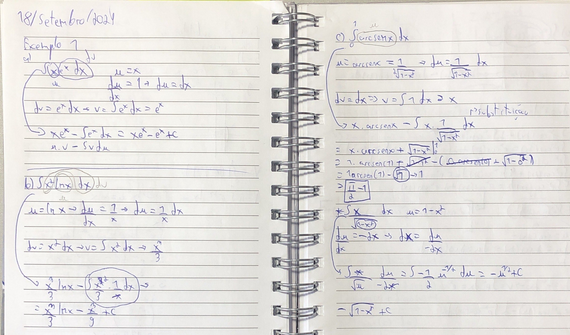
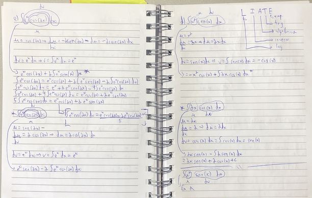
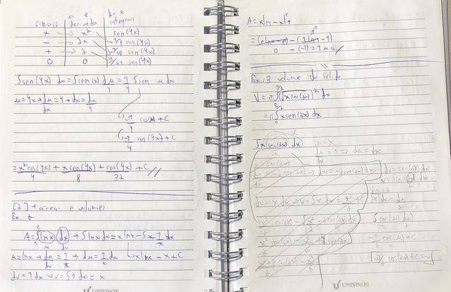
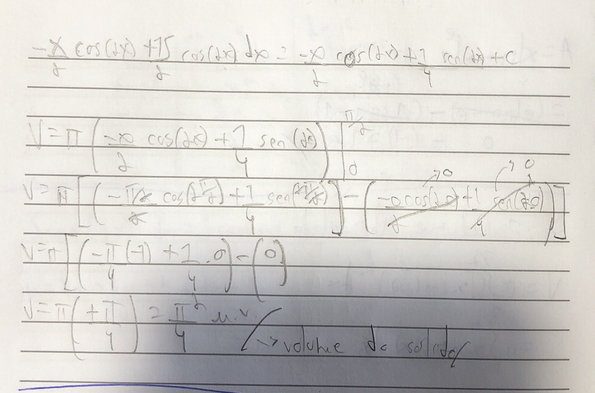

# Integração por partes
Essa forma de resolução é útil principalmente com funções muito complexas ou com fatores que fogem um pouco das normas pré-estabelecidas de cálculos.
Ela se baseia na derivada de um produto e basicamente nos auxilia a separar a equação em duas e resolver ambas as partes separadamente, juntando-as ao final.
O teorema básico é, considerando uma função contínua:
**∫udv = uv - ∫vdu**

Importante ressaltar que é mais fácil resolver tomando *dv* como o termo mais complexo (e que pode ser integrado). Sendo assim, *u* sobraria como uma derivada simples.

- resolve os problemas que a substituição não consegue
    - eventualmente ainda usa substituição
- baseado em regra da cadeia e função composta
- envolve produto de funções
    - regra da derivada de produto (em parte)
- tem uma fómula de utilização
- considere duas funções diferenciáveis
- mantém a primeira e multiplica pela derivada da segunda e soma com o inverso
- íntegrando a derivada pega a própria função
- nas integrais novas se simplifica os dx e se tem uma integral com duas variáveis
- [1 ]
- a integral u dv sempre precisa ser mais simples
- a mesma lógica se aplica para áreas e volumes

### Referências
- ANTON, Howard; BIVENS, Irl; DAVIS, Stephen. Cálculo. 10. ed. Porto Alegre: Bookman, 2014. v. 1
- Material de aula fornecido pela Profª Zeliane Santos de Arruda (Unisinos)