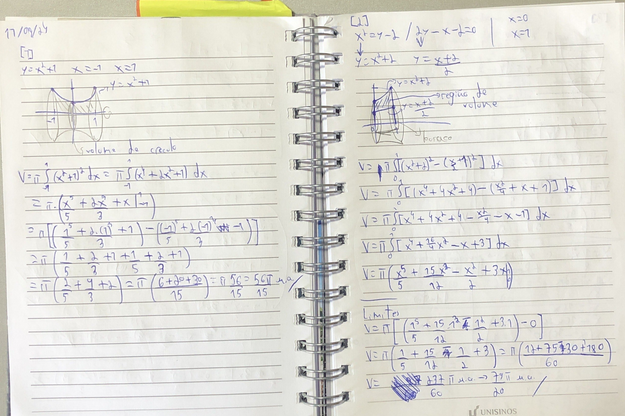
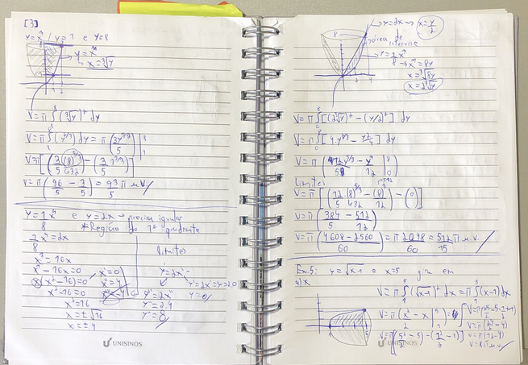
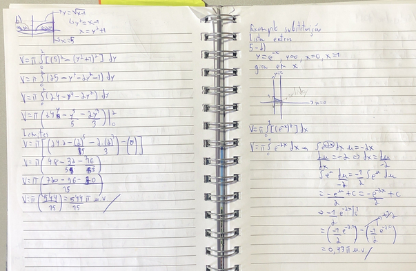

# Volumes
- usualmente se faz uma integral da função da área do objeto
- a maioria se dá por eixos de revolução

## volume por discos perpendicales ao eixo dos x
- gira-se uma região em torno do eixo dos x (qualquer forma q ela tenha)
- integral definida de a até da Àrea da região em x
- tira uma faatia da região (área de um círculo nesse caso)
    - pir²
    - função representa o raio
- pi integral de a até b função ² de x
    - volume de sólido de revolução
- [1 ]

## Volume por arruelas perpendiculares ao eixo dos x
- elas tem um certo espaço entre o eixo dos x
- basicamente uma área entre funções e um giro pelo eixo
- ainda se tira uma fatia
- V = pi integral de a até b pela função de fora (fx) ² menos a função de dentro (g(x)) ²
- nesses contextos é ideal tem um gráfico
    - ou um rapidamente construído
- [2 ]

## Todas as propriedades para o eixos dos x também valem para y
- os calculos só precisam ser em favor de y
- [3 ]
- uma função por volume em x não necessariamente é igual para y
    - os sólidos gerados são diferentes, ou seja, ele necessariamente precisam ser iguais

### Referências
- ANTON, Howard; BIVENS, Irl; DAVIS, Stephen. Cálculo. 10. ed. Porto Alegre: Bookman, 2014. v. 1
- Material de aula fornecido pela Profª Zeliane Santos de Arruda (Unisinos)